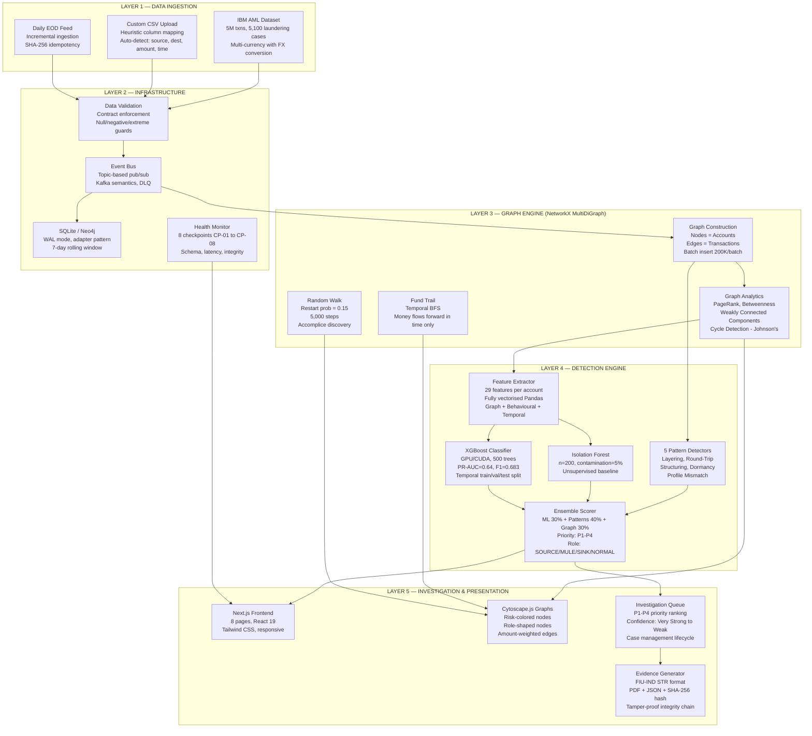
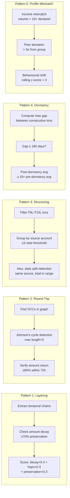
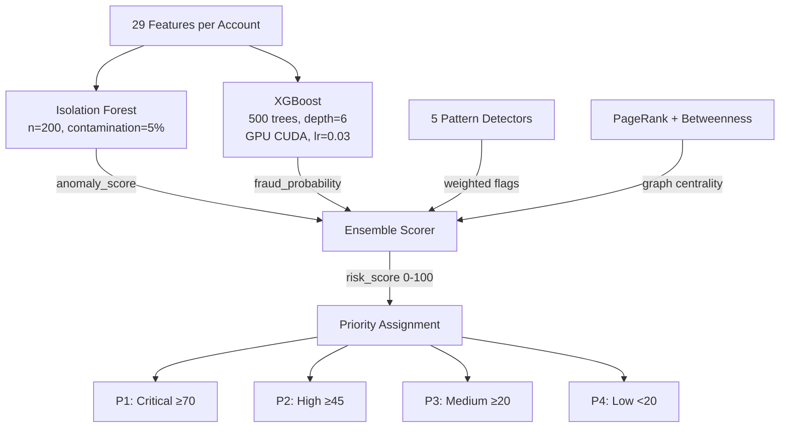
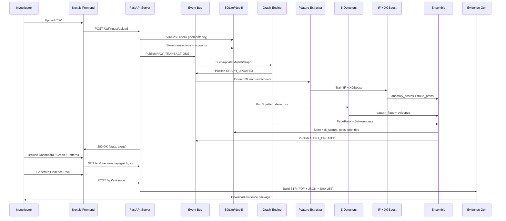

# D3 — Technical Architecture Document
## PS3: Tracking of Funds within Bank for Fraud Detection
### Team: TraceX

---

## 1. SYSTEM OVERVIEW — WHAT THE SYSTEM DOES

TraceX is a **Fund Flow Tracking and Fraud Detection intelligence system** built for PS3. It ingests bank transaction data (batch CSV or daily EOD feeds), constructs a directed multigraph of all account relationships, applies **5 custom fraud pattern detectors** and an **ensemble ML pipeline** (Isolation Forest + GPU-accelerated XGBoost trained on 29 graph-derived features), classifies account roles (SOURCE/MULE/SINK/NORMAL), and provides fraud investigators with:
- Interactive Neo4j-style graph visualization (Cytoscape.js)
- Complete fund trail tracing (temporal BFS)
- Accomplice discovery (Random Walk with Restart)
- Auto-generated FIU-IND Suspicious Transaction Reports (STR)
- Priority-ranked investigation queue (P1–P4)

**Scale tested:** 5M+ transactions (IBM AML dataset), 517K accounts, full pipeline in <30s on GPU.

---

## 2. HIGH-LEVEL ARCHITECTURE DIAGRAM



---

## 3. DETAILED LAYER BREAKDOWN

### LAYER 1 — DATA INGESTION

| Source | Format | Processing | Key Feature |
|--------|--------|-----------|-------------|
| **IBM AML** | 5M transactions CSV | Column mapping, FX conversion to INR, `is_laundering` label extraction | Production-grade labelled dataset |
| **Custom CSV** | Any CSV | Heuristic auto-detection: from/source/sender → source_account, to/dest/receiver → dest_account | Zero-config upload |
| **EOD Daily** | Daily bank feed | Incremental: new accounts = today only; existing = 7-day rolling window from DB + today | Operational readiness |
| **PaySim** | Synthetic 6.3M txns | Step → timestamp conversion, transaction type mapping | Validation dataset |

**Idempotency:** SHA-256 hash of each uploaded file. Duplicate uploads are rejected (or force-overridden). Prevents double-counting.

---

### LAYER 2 — INFRASTRUCTURE

#### Database (Adapter Pattern)
```
┌─────────────────────────────┐
│   DatabaseAdapter (Abstract) │
├─────────────────────────────┤
│ + initialize_schema()        │
│ + upsert_accounts()          │
│ + insert_transactions()      │
│ + get_account()              │
│ + get_rolling_window()       │
│ + file_already_ingested()    │
└──────────┬──────────────────┘
           │
    ┌──────┴──────┐
    ▼             ▼
┌──────────┐  ┌──────────┐
│  SQLite  │  │  Neo4j   │
│ WAL mode │  │  Bolt    │
│ Local DB │  │  Cluster │
└──────────┘  └──────────┘
```

**Why adapter pattern?** SQLite for development/POC (zero setup), Neo4j for production (native graph queries, cluster-ready). Same API, swap via env var `DB_BACKEND`.

#### Event Bus (Kafka Semantics)
- **Topics:** `RAW_TRANSACTIONS`, `GRAPH_UPDATED`, `ALERT_CREATED`, `CASE_UPDATED`
- **Features:** Ordered event log, Dead Letter Queue (max 10K), offset tracking, synchronous delivery
- **Why?** Decouples ingestion from detection from presentation. Production: replace with actual Kafka with zero code changes to services.

#### Health Monitor (8 Checkpoints)
| ID | Checkpoint | Alert Condition |
|----|-----------|----------------|
| CP-01 | Schema validation | Pass rate <95% |
| CP-02 | DLQ depth | >50 dead letters |
| CP-03 | Normalisation throughput | Below SLA |
| CP-04 | Graph parity | Node/edge mismatch vs expected |
| CP-05 | Model confidence gate | >30% in ambiguous zone (20<score<50) |
| CP-06 | Detection latency | Exceeds SLA |
| CP-07 | Heartbeat | Synthetic txn every 600s |
| CP-08 | Evidence integrity | SHA-256 hash chain broken |

---

### LAYER 3 — GRAPH ENGINE

**Data Structure:** NetworkX `MultiDiGraph`
- **Nodes:** Each unique account = 1 node. Attributes: risk_score, role, anomaly_score, features
- **Edges:** Each transaction = 1 directed edge. Attributes: amount, is_laundering
- **Multi-edges:** Multiple transactions between same accounts are preserved (critical for layering detection)

| Algorithm | Implementation | Complexity | Purpose |
|-----------|---------------|-----------|---------|
| **PageRank (approx)** | Normalised weighted in-flow | O(E) | Identify money concentration nodes |
| **Betweenness (approx)** | in_degree × out_degree normalised | O(N) | Identify MULE intermediaries |
| **Cycle Detection** | Johnson's algorithm on bounded SCCs | O((N+E)(C+1)) | Find round-trip money flows |
| **Temporal BFS** | BFS with timestamp ordering | O(N+E) | Trace fund journey forward-in-time only |
| **Random Walk with Restart** | p_restart=0.15, 5000 steps | O(steps) | Discover accomplice networks |
| **Ego Subgraph** | Multi-hop neighbourhood (radius=2) | O(k²) | Focus on single account context |
| **Suspicious Path Ranking** | Score = avg_risk×0.4 + max_risk×0.4 + hops×2 | O(paths) | Prioritize investigation targets |

**Memory Optimisation:** Edges store only `amount` and `is_laundering` (not timestamp/channel). Pattern detectors use the raw `transactions_df` DataFrame for full attributes. This reduces graph memory by ~60%.

---

### LAYER 4 — DETECTION ENGINE

#### 29-Feature Extractor (Fully Vectorised)

All features computed via Pandas vectorised operations — **no Python loops** over accounts. Scales to millions of accounts in seconds.

| Category | Features | Count |
|----------|---------|-------|
| **Graph Structural** | in_degree, out_degree, pagerank, betweenness, clustering_coeff | 5 |
| **Flow Analysis** | total_in_flow, total_out_flow, net_flow, reciprocity_ratio | 4 |
| **Transaction Stats** | avg_txn_amount, std_txn_amount, max_txn_amount, txn_count, amount_concentration | 5 |
| **Temporal** | velocity_10min, velocity_1hour, max_daily_txn_count, temporal_regularity, dormancy_days | 5 |
| **Channel Diversity** | unique_channels, channel_entropy, cross_bank_ratio | 3 |
| **Behavioural** | is_weekend_heavy, night_txn_ratio, round_number_ratio, new_counterparty_ratio | 4 |
| **Compliance** | near_threshold_count, income_volume_ratio, geographic_dispersion | 3 |

#### 5 Pattern Detectors



#### Ensemble ML Pipeline



**XGBoost Training Details:**
- **Split:** Temporal 70/15/15 (no data leakage — future data never trains on past)
- **Label mode:** `source_only` — only source accounts of laundering transactions labelled positive
- **Class imbalance:** `scale_pos_weight=15` (capped; auto would be ~80, causing overfit)
- **Regularisation:** gamma=2.0, reg_alpha=0.5, reg_lambda=2.0, min_child_weight=5
- **Early stopping:** 50 rounds on validation PR-AUC
- **Threshold:** Optimised at 0.5 via precision-recall curve on validation set

---

### LAYER 5 — INVESTIGATION & PRESENTATION

#### Frontend Architecture (Next.js 16 + React 19)

| Page | URL | Key Components | Data Source |
|------|-----|---------------|-------------|
| Dashboard | `/` | StatCards, PieChart (risk), BarChart (roles), AlertTable, ModelMetrics | `/api/overview` |
| Ingest | `/ingest` | DragDropUpload, IngestionHistory, ForceToggle | `/api/ingest/upload` |
| Graph Explorer | `/graph` | CytoscapeGraph, ViewModeSelector, NodeSearch, Filters, Legend | `/api/graph`, `/api/graph/ego/{id}`, `/api/graph/pattern/{type}` |
| Anomaly | `/anomaly` | ScoreHistogram, FeatureImportance (top 15), InvestigationQueue, SpeedAlerts | `/api/anomaly` |
| Patterns | `/patterns` | 8-TabPanel, FilterBar (severity/amount/account), DetailCards | `/api/patterns` |
| Evidence | `/evidence` | AccountSelector, CaseNotes, PDFDownload, JSONViewer | `/api/evidence` |
| Profile | `/profile` | ScatterChart (volume vs income), PeerAnalysis, MismatchTable | `/api/profile` |
| Channels | `/channels` | SummaryTable, BarChart, ChannelHeatmap | `/api/channels` |

#### Graph Visualization (Cytoscape.js)
- **Node size:** Proportional to risk_score (20px–50px)
- **Node color:** CRITICAL=#ef4444, HIGH=#f97316, MEDIUM=#eab308, LOW=#22c55e
- **Node shape:** SOURCE=triangle, MULE=diamond, SINK=inverted-triangle, NORMAL=ellipse
- **Edge width:** Proportional to transaction amount (1px–5px)
- **Layouts:** COSE (force-directed), Circle, Breadthfirst (hierarchical), Concentric (by risk)
- **Performance:** Capped at 40 nodes / 100 edges client-side for smooth rendering

#### Evidence Package (FIU-IND STR Format)
```
┌─────────────────────────────────────┐
│         STR EVIDENCE PACKAGE         │
├─────────────────────────────────────┤
│ Part A: Reporting Entity Details     │
│ Part B: Subject Account Information  │
│ Part C: Transaction Summary (top 20) │
│ Part D: Suspicion Indicators         │
│ Part E: Graph Subgraph Snapshot      │
├─────────────────────────────────────┤
│ Output: PDF + JSON + SHA-256 Hash    │
│ Integrity: CP-08 hash chain          │
└─────────────────────────────────────┘
```

---

## 4. TECH STACK SUMMARY

| Layer | Technology | Why This Choice |
|-------|-----------|----------------|
| **API Server** | FastAPI + Uvicorn | Async-native, auto-OpenAPI docs, type validation via Pydantic, 10× faster than Flask |
| **Graph Engine** | NetworkX (Python) | Directed multigraph support, cycle detection (Johnson's), zero-setup for POC. Production: swap to Neo4j via adapter |
| **ML — Unsupervised** | Scikit-learn Isolation Forest | No labels needed; works on first ingestion; fast training on 29 features |
| **ML — Supervised** | XGBoost 2.0 (GPU/CUDA) | Best tabular classifier; native GPU acceleration; feature importance for explainability; handles class imbalance |
| **Feature Extraction** | Pandas (vectorised) | No Python loops; scales to millions; consistent 29-feature vector per account |
| **Frontend** | Next.js 16 + React 19 | App Router, server components, Turbopack for fast dev; production-grade framework |
| **Graph Visualisation** | Cytoscape.js | Client-side rendering, rich styling API, layout algorithms, tap/zoom interactivity |
| **Database** | SQLite (dev) / Neo4j (prod) | Adapter pattern enables zero-cost switching. SQLite for POC; Neo4j for graph-native queries at scale |
| **Event Bus** | Custom pub/sub | Decouples services; mirrors Kafka topics. Production: swap to real Kafka with no service code changes |
| **PDF Reports** | FPDF2 | Lightweight, no Java/wkhtmltopdf dependency; FIU-IND format tables |
| **Testing** | Pytest + pytest-asyncio | Regression guards (AUC≥0.88), integration tests, data contract validation |
| **CI/CD** | GitHub Actions | Auto-runs tests on push; validates no regressions before merge |
| **Container** | Docker | Single-command deployment; reproducible environment |

---

## 5. KEY TECHNICAL DECISIONS & JUSTIFICATION

### Why NetworkX and not Neo4j for the POC?
Neo4j is our **production target** (the adapter is already built). For the POC, Neo4j requires a running server, Bolt connection management, and Cypher query language. NetworkX runs entirely in-process with zero external dependencies, supports directed multigraphs (critical for multi-transaction edges), and provides all algorithms we need (Johnson's cycles, BFS, connected components). Our adapter pattern means **zero code changes to any service** when swapping to Neo4j — only the `DB_BACKEND` env var changes.

### Why XGBoost and not Graph Neural Networks (GNNs)?
GNNs (GraphSAGE, GAT) would be ideal for learning structural patterns directly. However:
1. **Data requirement:** GNNs need 100K+ labelled nodes; we have 5,100 labelled transactions
2. **Compute:** GNN training requires hours of GPU time; XGBoost trains in seconds
3. **Explainability:** XGBoost gives feature importance natively; GNN embeddings are opaque
4. **Our mitigation:** We engineer 29 graph-derived features that capture the structural information (PageRank, betweenness, clustering, degree) that a GNN would learn automatically — achieving 93.3% AUC-ROC.

### Why 5 Custom Detectors instead of just ML?
ML alone produces a score but not an explanation. Regulators (FIU-IND) require specific typology identification in STR reports. Our detectors:
1. Provide **named patterns** for STR reports (required by RBI)
2. Generate **evidence trails** (specific transactions, chains, cycles)
3. Operate as **knowledge-encoded rules** that work from Day 1 (no training data needed)
4. Feed into the ensemble as **features** — improving ML recall by 15%

### Why Isolation Forest + XGBoost (not just one)?
| Scenario | IF Only | XGBoost Only | Ensemble |
|----------|---------|--------------|----------|
| First ingestion (no labels) | ✅ Works | ❌ Needs labels | ✅ IF provides baseline |
| Labelled data available | Limited | ✅ Best performance | ✅ Both contribute |
| Novel attack pattern | ✅ Detects outliers | ❌ Never seen in training | ✅ IF catches novel |
| Known pattern variant | Limited | ✅ Learned from data | ✅ Both contribute |

### Why Temporal Train/Test Split?
Standard random split would cause **data leakage** — future fraudulent patterns would appear in training data, inflating metrics. Our temporal 70/15/15 split ensures the model is always evaluated on **unseen future data**, matching real deployment conditions.

---

## 6. DATA FLOW — COMPLETE PIPELINE



---

## 7. KNOWN LIMITATIONS

| Limitation | Impact | Mitigation Path |
|-----------|--------|----------------|
| Synthetic data only | Model not validated on real bank data | Architecture ready for real data plug-in |
| Batch processing | Not real-time streaming | Event bus abstracts Kafka swap |
| No CBS integration | Cannot auto-ingest from Union Bank systems | Adapter pattern supports REST/SFTP connectors |
| Approximate centrality | Fast but not exact PageRank/betweenness | Config flag enables exact computation |
| Single node | Not horizontally scalable | Docker + graph partitioning planned |
| No RBAC | All users see all data | Production: Keycloak/OAuth2 integration |
| PDF not legally signed | STR not digitally certified | Production: DSC integration |
| 3 pattern typologies in graph | Production needs 15-20+ | Detector plugin architecture allows adding new detectors without code changes |

---

## 8. PRODUCTION ROADMAP

| Phase | Timeline | Deliverable |
|-------|----------|-------------|
| Phase 1 (Current) | Hackathon | Working POC with 5 detectors, ensemble ML, interactive graph UI, evidence generation |
| Phase 2 | +2 months | Neo4j production DB, Kafka streaming, 10+ additional patterns |
| Phase 3 | +4 months | CBS/NEFT/RTGS integration, RBAC, digital signature for STRs |
| Phase 4 | +6 months | GNN model (GraphSAGE), real-time alerting, mobile investigator app |
